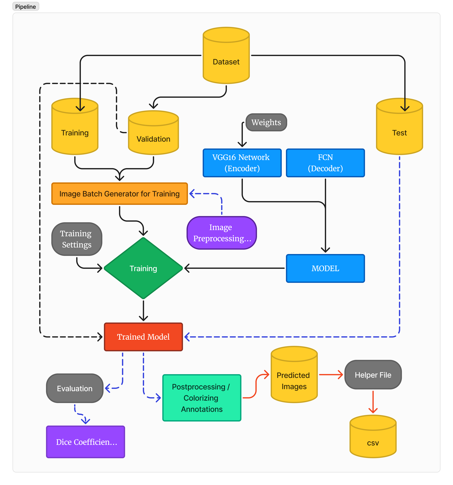

# Road Segmentation Using Transfer Learning with VGG16 and Fully Convolutional Networks

**Primary objectives of this project:**
- Develop an efficient image segmentation model capable of classifying each pixel of an Indian road image into one of 27 classes.
- Leverage transfer learning by utilizing a pre-trained VGG16 network for feature extraction, thereby improving the model's performance and reducing training time.
- Implement and evaluate the performance of the FCN in conjunction with VGG16 on the segmentation task.
- Assess the model's performance using metrics such as pixel-wise accuracy, Dice Coefficient, and F1 Beta Score.

### Dataset Description

The dataset used for this project consists of images depicting Indian roads, along with their corresponding segmentation masks. The dataset is organized into three main folders:

- **Train**: Contains the training images in JPEG format.
- **Labels**: Contains the corresponding segmentation masks in PNG format.
- **Test**: Contains images designated for testing the trained model.
Dataset Link : [https://www.kaggle.com/datasets/himanshusinghal19/ml-bootcamp-dataset]


The `dataset.py` script is responsible for organizing the dataset by separating images and labels into their respective folders. It ensures that each image in the `train/images` folder has a corresponding label in the `train/labels` folder, maintaining the same order and naming convention with different file formats (JPEG for images and PNG for labels).

### Model and Training Settings

The model architecture combines a pre-trained VGG16 network with a Fully Convolutional Network (FCN) for pixel-wise classification. Transfer learning is utilized to leverage the feature extraction capabilities of VGG16, which is fine-tuned during training to adapt to the specific segmentation task.

The VGG16 network, serves as the encoder in the FCN architecture. The fully connected layers of VGG16 are removed, and the convolutional layers are retained to extract hierarchical features from the input images. This pre-trained network provides a robust foundation for feature extraction, reducing the need for extensive training from scratch.

The FCN replaces the fully connected layers of traditional CNNs with convolutional layers that output spatial maps, enabling pixel-wise classification. The `model.py` script defines the `fcn_8_vgg` function, which constructs the FCN-8 architecture by integrating the VGG16 encoder with upsampling layers and skip connections for finer segmentation details. This architecture allows the model to retain spatial information while performing deep feature extraction.

#### Training Configuration

The training process was orchestrated using the `train.py` script with the following settings:

- **Batch Size**: Initially set to 32, later reduced to 16 to accommodate hardware limitations.
- **Image Sizes**: 224 × 312 pixels and 416 × 608 pixels.
- **Epochs**: 5 epochs due to computational constraints.
- **Optimizer**: Adam optimizer with default learning rate settings.
- **Loss Function**: Categorical Cross-Entropy loss.
- **Data Split**: 80% training and 20% validation split.
- **Hardware**: Training was conducted on a CPU (Intel i5 13th Gen), resulting in longer training times.

#### Training Process

The training process involves the following steps:

1. **Data Loading**: The `dataset.py` script separates images and labels into training and validation sets.
2. **Batch Generation**: The `functions.py` script handles batch generation, loading images and labels, applying normalization, resizing, and augmentation.
3. **Model Initialization**: The `fcn_8_vgg` model is initialized with the specified number of classes and input dimensions.
4. **Compilation**: The model is compiled with the Adam optimizer and categorical cross-entropy loss.
5. **Training Loop**: The `train.py` script runs the training loop for the defined number of epochs, adjusting the batch size as necessary.
6. **Checkpointing**: Model weights are saved periodically to allow for recovery and evaluation.

#### Prediction Process

The `predict.py` script facilitates the prediction of segmentation masks on test images. The steps involved are:

1. **Loading the Model**: The saved model weights are loaded.
2. **Preprocessing**: Test images are preprocessed in the same manner as training images, including normalization and resizing.
3. **Prediction**: The model predicts segmentation masks for the input images.
4. **Post-processing**: The binary masks are converted into color-coded segmented images using the predefined class colors.
5. **Saving Results**: The segmented images are saved in the designated output directory.

### Visualization of Segmentation Results

Segmented images were generated by mapping the predicted binary masks to their corresponding class colors. Below is an example of the original image alongside its segmented output:


*Figure: Sample Predicted Images of Segmentation*

### Project File Structure

The project is organized into several directories and scripts, each responsible for different aspects of the segmentation pipeline.

```plaintext
project/
│
├── data/
│   ├── train/
│   │   ├── images/
│   │   └── labels/
│   ├── val/
│   │   ├── images/
│   │   └── labels/
│   └── test/
│       └── images/
│
├── models/
│   ├── VGG16.py
│   ├── model.py
│   └── utils.py
│
├── scripts/
│   ├── train.py
│   ├── predict.py
│   ├── functions.py
│   ├── augmentation.py
│   ├── dataset.py
│   └── evaluation.ipynb
│
├── checkpoints/
│   └── model_weights.h5
│
├── helper.py
└── README.md
```

### Detailed Function Descriptions

#### VGG16.py

- **Functionality**: Implements the VGG16 network architecture for feature extraction.
- **Key Components**:
  - Loading pre-trained weights from ImageNet.
  - Modifying the architecture to remove fully connected layers.
  - Outputting feature maps for the FCN.

#### model.py

- **Functionality**: Defines the FCN architecture by integrating VGG16 with additional convolutional layers.
- **Key Components**:
  - `fcn_8_vgg` function: Constructs the FCN-8 architecture, adding upsampling layers and skip connections for finer segmentation.

#### utils.py

- **Functionality**: Provides utility functions for building and processing the segmentation model.
- **Key Components**:
  - Merging feature maps from different layers.
  - Implementing upsampling operations to match the input image size.

#### train.py

- **Functionality**: Handles the training loop for the segmentation model.
- **Key Components**:
  - Loading training and validation data.
  - Compiling the model with appropriate loss functions and optimizers.
  - Saving model checkpoints.
  - Monitoring training progress.

#### predict.py

- **Functionality**: Facilitates the prediction and visualization of segmentation masks on test data.
- **Key Components**:
  - Loading the trained model.
  - Predicting segmentation masks for new images.
  - Mapping binary masks to colored segmented images based on class IDs and colors.

#### functions.py

- **Functionality**: Contains essential functions for data handling and batch generation.
- **Key Components**:
  - Loading and preprocessing images and labels.
  - Implementing the batch generator for training.

#### augmentation.py

- **Functionality**: Implements data augmentation techniques to enhance training data diversity.
- **Key Components**:
  - Functions for flipping, rotating, blurring, and adjusting contrast and brightness of images.

#### dataset.py

- **Functionality**: Organizes and prepares the dataset by separating images and labels.
- **Key Components**:
  - Extracting image and label pairs.
  - Ensuring correspondence between training and validation sets.

## References

- Long, Jonathan, Evan Shelhamer, and Trevor Darrell. "Fully convolutional networks for semantic segmentation." *Proceedings of the IEEE Conference on Computer Vision and Pattern Recognition*. 2015.
- Simonyan, Karen, and Andrew Zisserman. "Very deep convolutional networks for large-scale image recognition." *arXiv preprint arXiv:1409.1556* (2014).
- Chen, Liang-Chieh, et al. "Semantic image segmentation with deep convolutional nets and fully connected CRFs." *arXiv preprint arXiv:1412.7062* (2014).
- Ronneberger, Olaf, Philipp Fischer, and Thomas Brox. "U-Net: Convolutional Networks for Biomedical Image Segmentation." *International Conference on Medical Image Computing and Computer-Assisted Intervention*. Springer, Cham, 2015.

